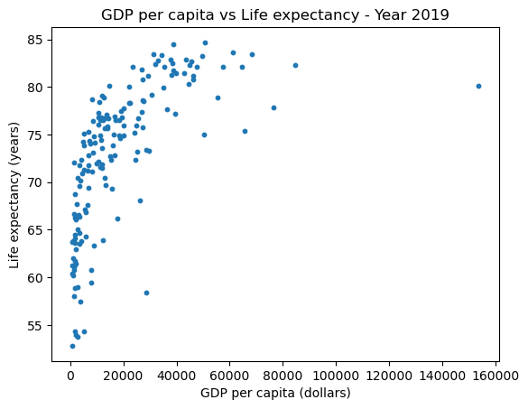
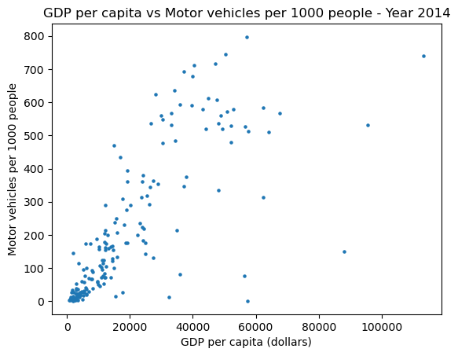

```python
import numpy
import pandas
import matplotlib.pyplot as plt
```


```python
df = pandas.read_csv("life-expectancy-vs-gdp-per-capita.csv")
df.dropna(subset=['Life expectancy', 'GDP per capita'], inplace=True)
df.drop(columns=['Code', '417485-annotations', 'Population (historical estimates)', 'Continent'], inplace=True)
```


```python
df18 = df[df['Year'] == 2018].drop(columns=['Year'])
```


```python
df18['GDP per capita'].describe()
```


    count       166.000000
    mean      19030.645835
    std       20286.783638
    min         623.488892
    25%        4568.405640
    50%       12237.939941
    75%       27324.020020
    max      153764.171875
    Name: GDP per capita, dtype: float64


```python
df18['Life expectancy'].describe()
```


    count    166.000000
    mean      72.706699
    std        7.724799
    min       52.805000
    25%       66.928750
    50%       74.386500
    75%       78.429000
    max       84.687000
    Name: Life expectancy, dtype: float64


```python
plt.scatter(df18['GDP per capita'], df18['Life expectancy'], s=10)
plt.title('GDP per capita vs Life expectancy - Year 2019')
plt.xlabel('GDP per capita (dollars)')
plt.ylabel('Life expectancy (years)')
plt.show()
```


    

    


```python
df18[(df18['Life expectancy'] > 80.431498)]
```


<div>
<style scoped>
    .dataframe tbody tr th:only-of-type {
        vertical-align: middle;
    }

    .dataframe tbody tr th {
        vertical-align: top;
    }

    .dataframe thead th {
        text-align: right;
    }
</style>
<table border="1" class="dataframe">
  <thead>
    <tr style="text-align: right;">
      <th></th>
      <th>Entity</th>
      <th>Life expectancy</th>
      <th>GDP per capita</th>
    </tr>
  </thead>
  <tbody>
    <tr>
      <th>3117</th>
      <td>Australia</td>
      <td>83.281</td>
      <td>49830.800781</td>
    </tr>
    <tr>
      <th>3354</th>
      <td>Austria</td>
      <td>81.434</td>
      <td>42988.070312</td>
    </tr>
    <tr>
      <th>5260</th>
      <td>Belgium</td>
      <td>81.468</td>
      <td>39756.203125</td>
    </tr>
    <tr>
      <th>9041</th>
      <td>Canada</td>
      <td>82.315</td>
      <td>44868.742188</td>
    </tr>
    <tr>
      <th>12649</th>
      <td>Cyprus</td>
      <td>80.828</td>
      <td>27184.416016</td>
    </tr>
    <tr>
      <th>13632</th>
      <td>Denmark</td>
      <td>80.784</td>
      <td>46312.343750</td>
    </tr>
    <tr>
      <th>17487</th>
      <td>Finland</td>
      <td>81.736</td>
      <td>38896.699219</td>
    </tr>
    <tr>
      <th>17870</th>
      <td>France</td>
      <td>82.541</td>
      <td>38515.917969</td>
    </tr>
    <tr>
      <th>19476</th>
      <td>Germany</td>
      <td>81.180</td>
      <td>46177.617188</td>
    </tr>
    <tr>
      <th>20073</th>
      <td>Greece</td>
      <td>82.072</td>
      <td>23450.765625</td>
    </tr>
    <tr>
      <th>22766</th>
      <td>Hong Kong</td>
      <td>84.687</td>
      <td>50839.371094</td>
    </tr>
    <tr>
      <th>23396</th>
      <td>Iceland</td>
      <td>82.855</td>
      <td>43438.542969</td>
    </tr>
    <tr>
      <th>24590</th>
      <td>Ireland</td>
      <td>82.103</td>
      <td>64684.300781</td>
    </tr>
    <tr>
      <th>24915</th>
      <td>Israel</td>
      <td>82.819</td>
      <td>32954.769531</td>
    </tr>
    <tr>
      <th>25253</th>
      <td>Italy</td>
      <td>83.352</td>
      <td>34364.167969</td>
    </tr>
    <tr>
      <th>26183</th>
      <td>Japan</td>
      <td>84.470</td>
      <td>38673.808594</td>
    </tr>
    <tr>
      <th>30819</th>
      <td>Luxembourg</td>
      <td>82.102</td>
      <td>57427.500000</td>
    </tr>
    <tr>
      <th>32359</th>
      <td>Malta</td>
      <td>82.376</td>
      <td>32028.912109</td>
    </tr>
    <tr>
      <th>36935</th>
      <td>Netherlands</td>
      <td>82.143</td>
      <td>47474.109375</td>
    </tr>
    <tr>
      <th>37722</th>
      <td>New Zealand</td>
      <td>82.145</td>
      <td>35336.136719</td>
    </tr>
    <tr>
      <th>39831</th>
      <td>Norway</td>
      <td>82.271</td>
      <td>84580.132812</td>
    </tr>
    <tr>
      <th>43346</th>
      <td>Portugal</td>
      <td>81.857</td>
      <td>27035.599609</td>
    </tr>
    <tr>
      <th>48185</th>
      <td>Singapore</td>
      <td>83.458</td>
      <td>68402.343750</td>
    </tr>
    <tr>
      <th>48775</th>
      <td>Slovenia</td>
      <td>81.172</td>
      <td>29244.919922</td>
    </tr>
    <tr>
      <th>50164</th>
      <td>South Korea</td>
      <td>82.846</td>
      <td>37927.609375</td>
    </tr>
    <tr>
      <th>50702</th>
      <td>Spain</td>
      <td>83.433</td>
      <td>31496.519531</td>
    </tr>
    <tr>
      <th>52014</th>
      <td>Sweden</td>
      <td>82.654</td>
      <td>45541.890625</td>
    </tr>
    <tr>
      <th>52634</th>
      <td>Switzerland</td>
      <td>83.630</td>
      <td>61372.730469</td>
    </tr>
    <tr>
      <th>57387</th>
      <td>United Kingdom</td>
      <td>81.236</td>
      <td>38058.085938</td>
    </tr>
  </tbody>
</table>
</div>


```python
df18[(df18['Life expectancy'] > 75.431498) & (df18['Life expectancy'] < 80.431498)].sort_values(by=['GDP per capita']).head(2)
```


<div>
<style scoped>
    .dataframe tbody tr th:only-of-type {
        vertical-align: middle;
    }

    .dataframe tbody tr th {
        vertical-align: top;
    }

    .dataframe thead th {
        text-align: right;
    }
</style>
<table border="1" class="dataframe">
  <thead>
    <tr style="text-align: right;">
      <th></th>
      <th>Entity</th>
      <th>Life expectancy</th>
      <th>GDP per capita</th>
    </tr>
  </thead>
  <tbody>
    <tr>
      <th>12320</th>
      <td>Cuba</td>
      <td>78.726</td>
      <td>8325.630859</td>
    </tr>
    <tr>
      <th>35317</th>
      <td>Morocco</td>
      <td>76.453</td>
      <td>8451.135742</td>
    </tr>
  </tbody>
</table>
</div>


```python
df18[(df18['Life expectancy'] < 70.431498)].sort_values(by=['GDP per capita'], ascending=False).head(2)
```


<div>
<style scoped>
    .dataframe tbody tr th:only-of-type {
        vertical-align: middle;
    }

    .dataframe tbody tr th {
        vertical-align: top;
    }

    .dataframe thead th {
        text-align: right;
    }
</style>
<table border="1" class="dataframe">
  <thead>
    <tr style="text-align: right;">
      <th></th>
      <th>Entity</th>
      <th>Life expectancy</th>
      <th>GDP per capita</th>
    </tr>
  </thead>
  <tbody>
    <tr>
      <th>15373</th>
      <td>Equatorial Guinea</td>
      <td>58.402</td>
      <td>28528.953125</td>
    </tr>
    <tr>
      <th>55724</th>
      <td>Turkmenistan</td>
      <td>68.073</td>
      <td>26318.365234</td>
    </tr>
  </tbody>
</table>
</div>


```python
df = pandas.read_csv("road-vehicles-per-1000-inhabitants-vs-gdp-per-capita.csv")
df.rename(columns={'Motor vehicles per 1000 people (NationMaster (2014))': 'Motor vehicles per 1000 people', 
           'GDP per capita, PPP (constant 2017 international $)': 'GDP per capita'}, inplace=True)
df.dropna(subset=['Motor vehicles per 1000 people', 'GDP per capita'], inplace=True)
df.drop(columns=['Code', 'Year', 'Population (historical estimates)', 'Continent'], inplace=True)
```


```python
df['GDP per capita'].describe()
```


    count       180.000000
    mean      19643.322526
    std       19816.189777
    min         822.611206
    25%        4776.131714
    50%       12208.868652
    75%       27546.879883
    max      113313.578125
    Name: GDP per capita, dtype: float64


```python
df['Motor vehicles per 1000 people'].describe()
```


    count    180.000000
    mean     208.716667
    std      216.062925
    min        1.000000
    25%       28.000000
    50%      126.500000
    75%      345.250000
    max      797.000000
    Name: Motor vehicles per 1000 people, dtype: float64


```python
plt.scatter(df['GDP per capita'], df['Motor vehicles per 1000 people'], s=5)
plt.title('GDP per capita vs Motor vehicles per 1000 people - Year 2014')
plt.xlabel('GDP per capita (dollars)')
plt.ylabel('Motor vehicles per 1000 people')
plt.show()
```


    

    


```python
df[(df['Motor vehicles per 1000 people'] > 400)].sort_values(by=['GDP per capita'], ascending=False)
```


<div>
<style scoped>
    .dataframe tbody tr th:only-of-type {
        vertical-align: middle;
    }

    .dataframe tbody tr th {
        vertical-align: top;
    }

    .dataframe thead th {
        text-align: right;
    }
</style>
<table border="1" class="dataframe">
  <thead>
    <tr style="text-align: right;">
      <th></th>
      <th>Entity</th>
      <th>Motor vehicles per 1000 people</th>
      <th>GDP per capita</th>
    </tr>
  </thead>
  <tbody>
    <tr>
      <th>29477</th>
      <td>Luxembourg</td>
      <td>739.0</td>
      <td>113313.578125</td>
    </tr>
    <tr>
      <th>41189</th>
      <td>Qatar</td>
      <td>532.0</td>
      <td>95578.257812</td>
    </tr>
    <tr>
      <th>49178</th>
      <td>Switzerland</td>
      <td>566.0</td>
      <td>67682.687500</td>
    </tr>
    <tr>
      <th>7302</th>
      <td>Brunei</td>
      <td>510.0</td>
      <td>64190.824219</td>
    </tr>
    <tr>
      <th>37774</th>
      <td>Norway</td>
      <td>584.0</td>
      <td>62390.128906</td>
    </tr>
    <tr>
      <th>23742</th>
      <td>Ireland</td>
      <td>513.0</td>
      <td>57668.753906</td>
    </tr>
    <tr>
      <th>53962</th>
      <td>United States</td>
      <td>797.0</td>
      <td>57213.269531</td>
    </tr>
    <tr>
      <th>26245</th>
      <td>Kuwait</td>
      <td>527.0</td>
      <td>56647.437500</td>
    </tr>
    <tr>
      <th>3200</th>
      <td>Austria</td>
      <td>578.0</td>
      <td>52932.898438</td>
    </tr>
    <tr>
      <th>35391</th>
      <td>Netherlands</td>
      <td>528.0</td>
      <td>52186.996094</td>
    </tr>
    <tr>
      <th>13175</th>
      <td>Denmark</td>
      <td>480.0</td>
      <td>52048.335938</td>
    </tr>
    <tr>
      <th>18601</th>
      <td>Germany</td>
      <td>572.0</td>
      <td>50845.527344</td>
    </tr>
    <tr>
      <th>22447</th>
      <td>Iceland</td>
      <td>745.0</td>
      <td>50450.742188</td>
    </tr>
    <tr>
      <th>48919</th>
      <td>Sweden</td>
      <td>520.0</td>
      <td>49258.996094</td>
    </tr>
    <tr>
      <th>5012</th>
      <td>Belgium</td>
      <td>559.0</td>
      <td>48748.621094</td>
    </tr>
    <tr>
      <th>3979</th>
      <td>Bahrain</td>
      <td>537.0</td>
      <td>48201.156250</td>
    </tr>
    <tr>
      <th>8856</th>
      <td>Canada</td>
      <td>607.0</td>
      <td>47564.609375</td>
    </tr>
    <tr>
      <th>2941</th>
      <td>Australia</td>
      <td>717.0</td>
      <td>47232.875000</td>
    </tr>
    <tr>
      <th>17109</th>
      <td>Finland</td>
      <td>612.0</td>
      <td>44976.777344</td>
    </tr>
    <tr>
      <th>53702</th>
      <td>United Kingdom</td>
      <td>519.0</td>
      <td>44239.152344</td>
    </tr>
    <tr>
      <th>17368</th>
      <td>France</td>
      <td>578.0</td>
      <td>43021.394531</td>
    </tr>
    <tr>
      <th>35837</th>
      <td>New Zealand</td>
      <td>712.0</td>
      <td>40432.242188</td>
    </tr>
    <tr>
      <th>24332</th>
      <td>Italy</td>
      <td>679.0</td>
      <td>39898.527344</td>
    </tr>
    <tr>
      <th>24843</th>
      <td>Japan</td>
      <td>591.0</td>
      <td>39739.542969</td>
    </tr>
    <tr>
      <th>31066</th>
      <td>Malta</td>
      <td>693.0</td>
      <td>37230.304688</td>
    </tr>
    <tr>
      <th>47799</th>
      <td>Spain</td>
      <td>593.0</td>
      <td>35968.621094</td>
    </tr>
    <tr>
      <th>12656</th>
      <td>Czechia</td>
      <td>485.0</td>
      <td>34386.703125</td>
    </tr>
    <tr>
      <th>41069</th>
      <td>Puerto Rico</td>
      <td>635.0</td>
      <td>34070.261719</td>
    </tr>
    <tr>
      <th>12397</th>
      <td>Cyprus</td>
      <td>532.0</td>
      <td>33136.480469</td>
    </tr>
    <tr>
      <th>45989</th>
      <td>Slovenia</td>
      <td>567.0</td>
      <td>33093.750000</td>
    </tr>
    <tr>
      <th>15537</th>
      <td>Estonia</td>
      <td>476.0</td>
      <td>30494.095703</td>
    </tr>
    <tr>
      <th>40810</th>
      <td>Portugal</td>
      <td>548.0</td>
      <td>30444.599609</td>
    </tr>
    <tr>
      <th>28607</th>
      <td>Lithuania</td>
      <td>560.0</td>
      <td>29855.832031</td>
    </tr>
    <tr>
      <th>19191</th>
      <td>Greece</td>
      <td>624.0</td>
      <td>28129.960938</td>
    </tr>
    <tr>
      <th>40551</th>
      <td>Poland</td>
      <td>537.0</td>
      <td>26649.578125</td>
    </tr>
    <tr>
      <th>27312</th>
      <td>Lebanon</td>
      <td>434.0</td>
      <td>16969.371094</td>
    </tr>
    <tr>
      <th>4497</th>
      <td>Barbados</td>
      <td>469.0</td>
      <td>15041.554688</td>
    </tr>
  </tbody>
</table>
</div>


```python
df[(df['Motor vehicles per 1000 people'] < 400)].sort_values(by=['GDP per capita'], ascending=False).head(10)
```


<div>
<style scoped>
    .dataframe tbody tr th:only-of-type {
        vertical-align: middle;
    }

    .dataframe tbody tr th {
        vertical-align: top;
    }

    .dataframe thead th {
        text-align: right;
    }
</style>
<table border="1" class="dataframe">
  <thead>
    <tr style="text-align: right;">
      <th></th>
      <th>Entity</th>
      <th>Motor vehicles per 1000 people</th>
      <th>GDP per capita</th>
    </tr>
  </thead>
  <tbody>
    <tr>
      <th>45399</th>
      <td>Singapore</td>
      <td>149.0</td>
      <td>87959.414062</td>
    </tr>
    <tr>
      <th>53443</th>
      <td>United Arab Emirates</td>
      <td>313.0</td>
      <td>62452.183594</td>
    </tr>
    <tr>
      <th>43657</th>
      <td>San Marino</td>
      <td>1.0</td>
      <td>57328.078125</td>
    </tr>
    <tr>
      <th>21929</th>
      <td>Hong Kong</td>
      <td>77.0</td>
      <td>56359.300781</td>
    </tr>
    <tr>
      <th>44138</th>
      <td>Saudi Arabia</td>
      <td>336.0</td>
      <td>48209.136719</td>
    </tr>
    <tr>
      <th>47317</th>
      <td>South Korea</td>
      <td>376.0</td>
      <td>37967.476562</td>
    </tr>
    <tr>
      <th>24073</th>
      <td>Israel</td>
      <td>346.0</td>
      <td>37204.503906</td>
    </tr>
    <tr>
      <th>3720</th>
      <td>Bahamas</td>
      <td>81.0</td>
      <td>35801.917969</td>
    </tr>
    <tr>
      <th>38292</th>
      <td>Oman</td>
      <td>215.0</td>
      <td>34875.781250</td>
    </tr>
    <tr>
      <th>15018</th>
      <td>Equatorial Guinea</td>
      <td>13.0</td>
      <td>32436.552734</td>
    </tr>
  </tbody>
</table>
</div>


```latex
%%latex
\title{DAT405 Assignment 1 -- Group XXX}
\author{Student 1 - (xxx hrs) \\[2pt]Student 2 - (yyy hrs)}
\date{\today}
\begin{document}
\maketitle
```


\title{DAT405 Assignment 1 -- Group XXX}
\author{Student 1 - (xxx hrs) \\[2pt]Student 2 - (yyy hrs)}
\date{\today}
\begin{document}
\maketitle


